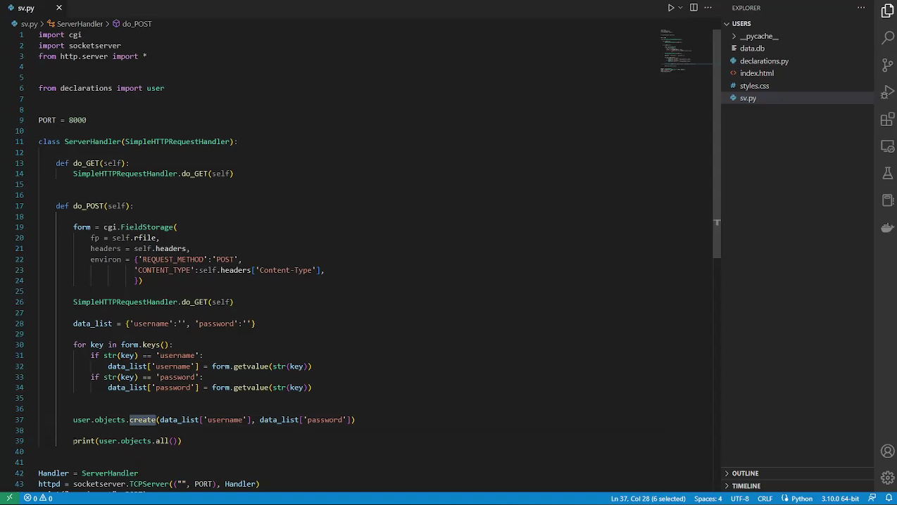

# SMART USER
## _Deploy and manage users on SQLite in a snap._


Smart user is a multi purpose lite module that allows you to work with SQLite databases to manage users in a few seconds with very intuitive methods.

## Features

-   You will perform 'CRUD' operations with local users as objects that will be seamlessly bound to the database.

-   Work with databases (sqlite) as objects: you can bound a specific sql object but work with another ones.

-   The passwords are encoded and hashed with algorithm hashes inherited from the cryptography library. You can change algorithms!

-   Migrate from json, dicts, set or list of them last two to user objects or migrate to json.

-   Connection to database is designed to remain open, which in some cases improves and in others get worse the performance, depending on the magnitude of the project, among others. If your application need it, you can close the connection and reopen it easily.


&nbsp;


You can see a small sample here, where i implement this module to register users on a web page.

<a href="https://www.youtube.com/watch?v=rcgSCzi9If8" target="_blank"></a>


&nbsp;


### However, this module is intended to be used in multiple ways, as for testing or to fast implement local users, and not just for the web.

It is also prudent to clarify that this is the first version of this module and it may not be very stable and can be a little bit dangerous to use in projects that require an internet connection, I always recommend making backup copies and safeguarding the data.


The passwords are secure, because them inherit from the crypthography module, using a PBKDF2 of 32 length at 480000 iterations with a random generated salt.

When are stored, PASSWORDS got the following format:    SALT \\\_/ ALGORITHM  \\\_/ HASH


&nbsp;

&nbsp;

---

## Installation

At your command prompt:

If you want to add it to your packages (pip) or if you want to work, or just save it:

>   pip install git+https://github.com/Guidoow/SmartUser.git

OR

>   python -m pip install git+https://github.com/Guidoow/SmartUser.git


If you just want to experiment with this module, you can implement a more dirty way :$
At your local working space:

>   git clone https://github.com/Guidoow/SmartUser.git


and then just       
```>>> from SmartUser.main import * ```

OR          
```>>> from SmartUser.main import user, sql ```

&nbsp;

&nbsp;

&nbsp;

---


## Documentation

For more information, i recommend check the documentation on the module where is specified a lot more about parameters of each method and some examples.

&nbsp;

## CLASS _USER_:

&nbsp;

>-   ``` run() ```          
>   Initializator method for bound a database.

>-   ``` exist() ```          
>   Returns a bool value whether the username exists in the local user objects or not.

>-   ``` change_username() ```          
>   Username changer/creator.

>-   ``` change_password() ```          
>   Password changer/creator. New salt (therefore new hash and result) will be created on every executing.

>-   ``` verify_password() ```          
>   Returns a bool value whether the password is true or not.

&nbsp;

---

&nbsp;

### Objects :  
``` user.objects ```

&nbsp;

>-   ``` create() ```                 
>   Creates a user object on the database, after in the local storage and then returns it.

>-   ``` delete() ```             
>   Delete user objects from database and local storage.

>-   ``` remove() ```              
>   Removes a user from the local storage, but not from the database.

>-   ``` all() ```          
>   Returns the local user objects list.

>-   ``` get() ```          
>   Returns the user object specified based in his username or None if non exists.

>-   ``` last() ```              
>   Returns the last object on the local storage.

>-   ``` first() ```          
>   Returns the last object on the local storage.

>-   ``` contains() ```          
>   Check if a user contains a string in the specified field.

&nbsp;

---

&nbsp;

### migrate_to :  
``` user.migrate_to ```

&nbsp;


>-   ``` sql() ```          
>   Access to the sql object if supplied, else to the bounded database and store the supplied user objects.

>-   ``` json() ```          
>   Returns a json from the list of local users.

&nbsp;

---

&nbsp;

### migrate_from :  
``` user.migrate_from ```

&nbsp;

>-   ``` sql() ```          
>   Given a sql object, it creates the users and stores them in the bound DB.

>-   ``` json() ```          
>   Given a json, a dict, a set or a list mixing them, it creates the users and stores them in the bound database.

&nbsp;

---

&nbsp;

## CLASS _SQL_:

&nbsp;

>-   ``` connect() ```          
>   Opens again a connection with his database file.

>-   ``` close() ```          
>   Close the connection with the database.

>-   ``` execute() ```          
>   Execute a SQL statement.

>-   ``` migrate() ```          
>   Migrate users to the bound database.

>-   ``` update() ```          
>   Update the user in the associated database.

>-   ``` get() ```          
>   Returns a single user from the database as a dict.

>-   ``` fetch() ```          
>   Fetch for all users in associated database and return them as Tuple or JSON/dict list.

>-   ``` delete() ```          
>   Execute a delete sentence and delete a row in the database.


